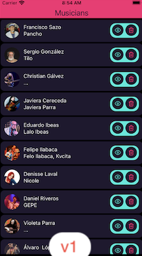
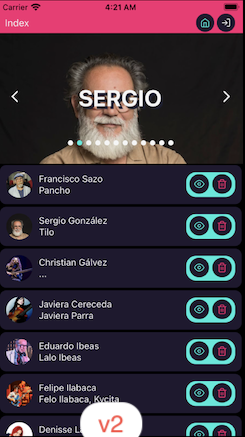

# Musician App

## This use Expo to create a native app for musicians

### Features

- Api for musician
- Api for user authentication
- Private Zone
- Persist JWT

## Libs

- Icons

`<https://feathericons.com/>`

- Swipe

`<https://docs.swmansion.com/react-native-gesture-handler/docs/#installation>`

Image App

- v1.0.0

- v2.0.0

  

